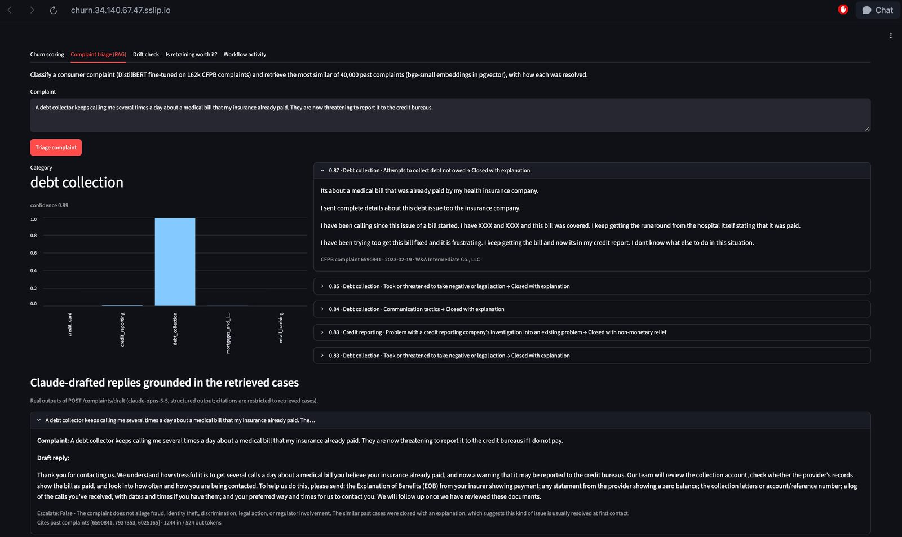
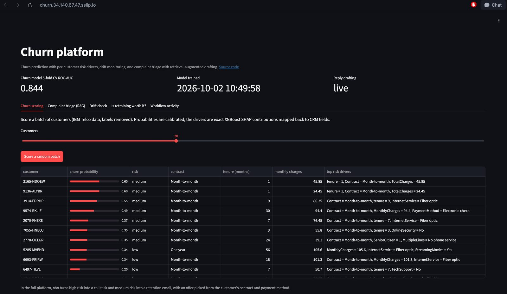
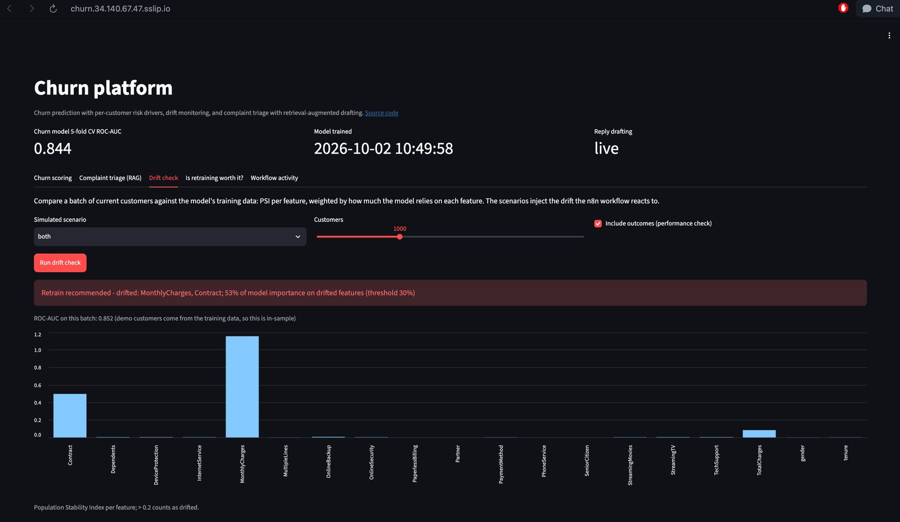
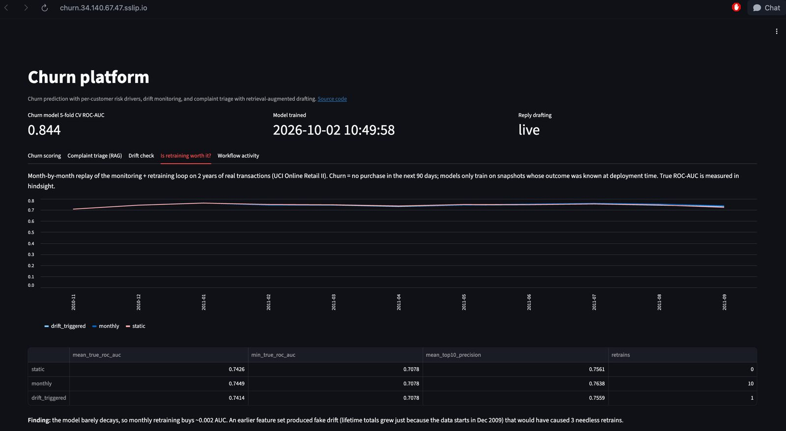
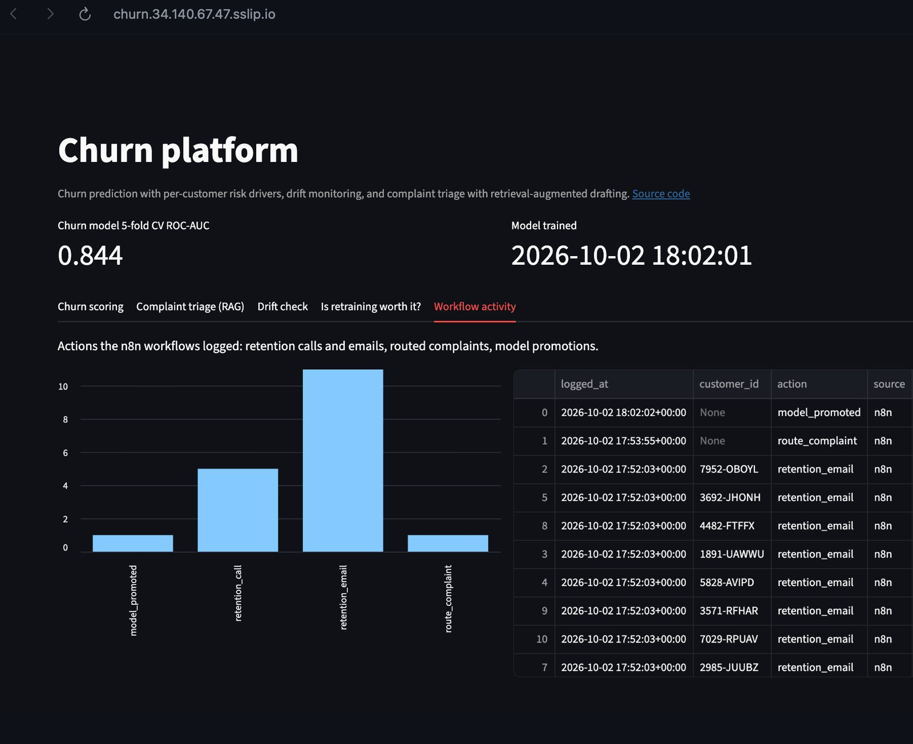
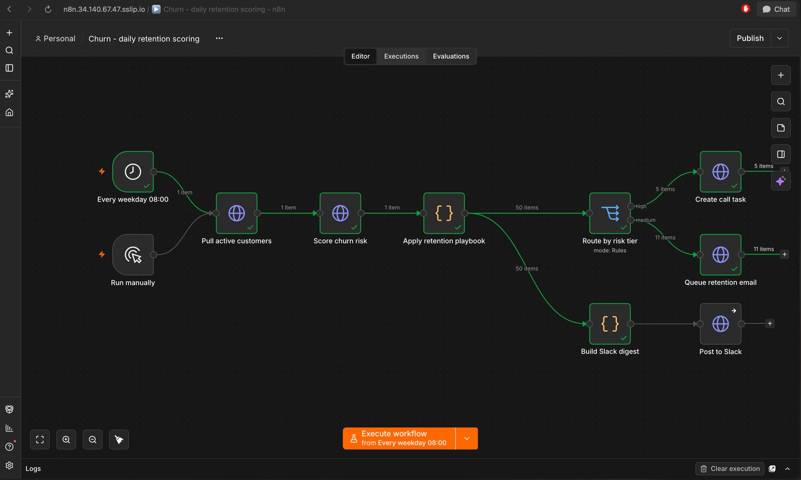
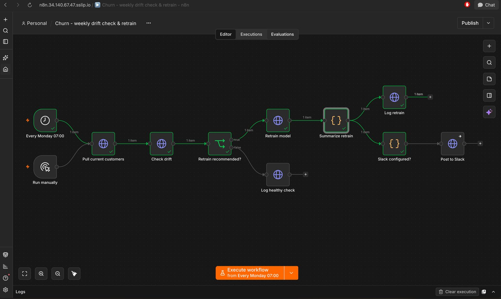
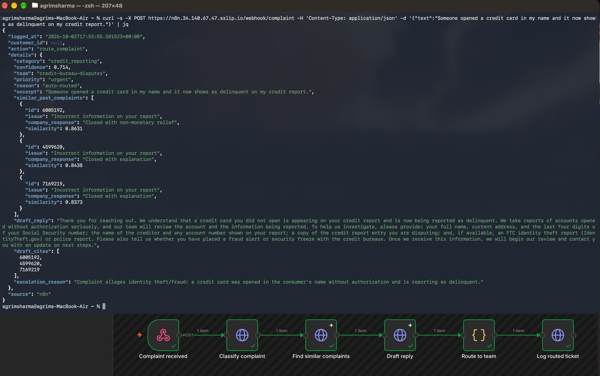
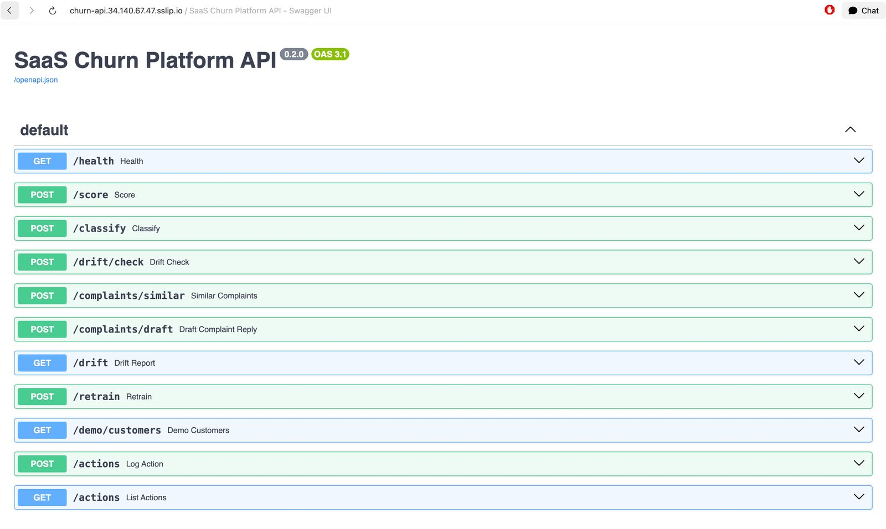
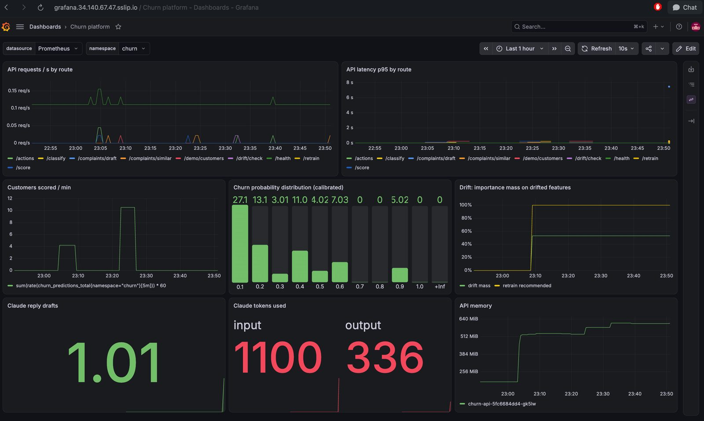

# SaaS Churn Platform

Churn prediction served behind a FastAPI service, with **n8n** workflows that turn predictions into actions:
- **Daily retention outreach:** score customers and create call or email tasks.
- **Complaint routing:** send each incoming complaint to the right team.
- **Drift-triggered retraining:** check for drift weekly and retrain, with a promotion gate.

A **Claude agent** answers questions about the platform by calling its tools ("which customers are most likely to leave, and what should we offer them?"), and an **MCP server** gives Claude Desktop, Claude Code or any MCP client the same tools. A Streamlit dashboard shows the predictions, the complaint triage, the agent and what the workflows did.

**Live demo: [agrimsharma--churn-platform.modal.run](https://agrimsharma--churn-platform.modal.run)** (free hosting: the first visit after a quiet spell takes ~30 s while the container starts. The agent is live with a small daily question budget. Reply drafting shows real examples instead of calling Claude, and n8n isn't hosted; both run in the [full deployment](#full-deployment-on-kubernetes) below.)

<p align="center"></p>

```
            ┌───────────────────── n8n (localhost:5678) ─────────────────────┐
 schedule → │ 01 retention   /demo/customers → /score → playbook → tasks + Slack │
 webhook  → │ 02 complaints  /classify → team routing → ticket                   │
 schedule → │ 03 drift       /drift/check → retrain? → /retrain (gated) → Slack  │
            └──────────────────────────────┬─────────────────────────────────┘
                                           │ HTTP + X-API-Key
 Streamlit dashboard (:8501) ──► FastAPI (:8000)
                                 XGBoost pipeline · isotonic calibration · SHAP drivers
                                 PSI drift vs training profile · DistilBERT complaints (opt.)
```

## Quick start

```bash
cp .env.example .env                 # set API_KEY; optionally SLACK_WEBHOOK_URL, WITH_NLP=true, ANTHROPIC_API_KEY
docker compose up -d --build
docker compose exec n8n n8n import:workflow --separate --input=/workflows
# RAG (needs WITH_NLP=true and the CFPB shard in data/raw/cfpb/): embed 40k complaints into pgvector
docker compose run --rm --no-deps api python scripts/build_complaint_index.py --n 40000
```

| Service | URL |
|---|---|
| n8n | http://localhost:5678 (create the owner account, open a workflow, click **Execute workflow**) |
| API docs | http://localhost:8000/docs |
| Dashboard | http://localhost:8501 |

To run a workflow without the UI (the CLI needs its own task-broker port while n8n is running):

```bash
docker compose exec -e N8N_RUNNERS_BROKER_PORT=5690 n8n n8n execute --id=ChurnRetention01
```

The complaint workflow must be **published** before its webhook listens. Either click **Publish** in the editor, or:

```bash
docker compose exec n8n n8n publish:workflow --id=ChurnComplaint02 && docker compose restart n8n
```

```bash
curl -X POST http://localhost:5678/webhook/complaint -H 'Content-Type: application/json' \
  -d '{"customer_id": "7590-VHVEG", "text": "A collector keeps calling about a debt I already paid."}'
```

### Without Docker

```bash
pip install -r requirements-dev.txt        # + requirements-nlp.txt for /classify
python scripts/train_scoring_model.py
uvicorn service.app:app --reload --port 8000
streamlit run dashboard/app.py
pytest tests
```

On macOS, xgboost needs OpenMP (`brew install libomp`).

**Data:** `data/raw/telco_churn_with_all_feedback.csv` (not committed). Any copy of the [IBM Telco churn dataset](https://github.com/IBM/telco-customer-churn-on-icp4d/blob/master/data/Telco-Customer-Churn.csv) works via `CHURN_DATA_PATH=...`, and CI uses exactly that.

## Results

**Churn model** (XGBoost, 7,043 customers, 26.5% churn):

| Metric | Value |
|---|---|
| 5-fold CV ROC-AUC | **0.844 ± 0.014** |
| Held-out ROC-AUC | 0.850 |
| Recall / precision at the decision threshold | 0.80 / 0.52 |
| Brier score, raw → calibrated | 0.160 → **0.135** |
| Mean predicted churn, raw → calibrated (observed 0.265) | 0.403 → **0.269** |

How to read these:
- Accuracy is 0.75, against 0.735 for always predicting "stays". ROC-AUC and recall are the numbers that matter here.
- The class-weighted model ranks customers well, but its raw probabilities run high. An isotonic calibrator fitted on out-of-fold predictions fixes that, so the retention playbook's "≥ 0.6" means about 60%.
- Top model features: Contract (52%), InternetService (13%), OnlineSecurity (5%), TechSupport (5%).

**Drift detection** (`POST /drift/check`, 800-customer batches):

| Simulated shift | Drifted features (PSI > 0.2) | Model importance on them | Retrain? |
|---|---|---|---|
| none | – | 0% | no |
| +25% prices | MonthlyCharges | 1% | no |
| 70% of long contracts → month-to-month | Contract | 52% | **yes** |
| both | MonthlyCharges, Contract | 53% | **yes** |

A plain "share of columns drifted" metric treats the harmless price shift and the damaging contract shift alike. Weighting by model importance separates them.

**Is retraining worth it? A backtest on real time-stamped data** (`scripts/retail_backtest.py`, [UCI Online Retail II](https://archive.ics.uci.edu/dataset/502/online+retail+ii), 1.07M transactions, 5.9k customers, Dec 2009 – Dec 2011, CC BY 4.0):

Telco is a single snapshot, so drift there can only be simulated. This replays the monitoring loop month by month on real data:
- **Snapshots:** each month, every customer active in the last 180 days, with features built only from their past transactions. The label is "no purchase in the next 90 days".
- **No peeking:** a model deployed in a given month only trains on snapshots whose 90-day outcome was already known then.

| Policy (Nov 2010 – Sep 2011) | Mean ROC-AUC | Worst month | Top-10% precision | Retrains |
|---|---|---|---|---|
| Never retrain | 0.743 | 0.708 | 0.756 | 0 |
| Retrain every month | **0.745** | 0.708 | 0.764 | 10 |
| Drift-triggered (the platform's rule) | 0.741 | 0.708 | 0.756 | 1 |

What this shows:
- **Retraining barely matters here.** The model is stable over 11 months, and monthly retraining gains 0.002 AUC.
- **The trigger was cautious but not perfect.** It fired once, in January 2011, on a post-Christmas dip in matured AUC (0.696) that turned out to be temporary. Requiring the AUC drop to be statistically significant (a bootstrap interval, since there are only ~4k customers a month) would have suppressed it.
- **The first feature set produced fake drift.** Lifetime totals and uncapped tenure grew every month simply because the dataset starts in December 2009, and that would have caused 3 retrains. Every feature now uses the same fixed 180-day window.

**Complaints classifier** (DistilBERT fine-tuned on 162k real CFPB complaints, 5 products, Vast.ai RTX 3060 Ti):
- Accuracy **0.885**, macro-F1 **0.857**.
- A TF-IDF + logistic-regression baseline scores 0.846 / 0.818.

**Similar-complaint retrieval (RAG)** (`scripts/build_complaint_index.py`):
- **Data:** 40,000 CFPB complaints with narratives from 2021 onwards, embedded with `bge-small-en-v1.5` into pgvector (HNSW index).
- **Evaluation:** 1,000 held-out complaints, measuring the share of the top 5 retrieved that share the query's label.

| Method | Same product | Same product **and** issue |
|---|---|---|
| Random chance | 0.508 | 0.151 |
| TF-IDF baseline | 0.817 | 0.522 |
| **bge-small + pgvector** | **0.833** | **0.545** |

How to read this:
- Embeddings are 3.6× better than chance on product and issue, but only ~2 points better than TF-IDF.
- CFPB labels are chosen by the consumer, so they're a noisy proxy for "the same problem".
- A warm query takes ~25 ms end to end, including 0.8 ms for the vector search.
- **Drafting:** Claude (`claude-opus-5-5`) writes a reply from the top 3 cases as structured output. Any cited ID that wasn't among the retrieved cases is dropped before the draft is returned. There's no evaluation of draft quality yet.
- **Data source:** the CFPB narratives come from the [CC0 Hugging Face mirror](https://huggingface.co/datasets/BEE-spoke-data/consumer-finance-complaints). The current official bulk export no longer includes narrative text.

**Found and removed: label leakage.**
- The first text model predicted churn from customer feedback and scored **1.0 on every metric**.
- The feedback had been LLM-generated from a prompt containing `Churn: Yes/No`, so the text encoded the label.
- Masking the word "churn" (`scripts/prepare_text.py`) didn't help, because the sentiment itself carries the answer.
- The model was dropped. The scripts stay as a record (`prepare_text*.py`, `train_text_model.py`).

## Claude agent and MCP server (tool calling)

```
                      ┌─ POST /agent/ask ── service/agent.py: Claude decides which tools to call
 7 tools, written     │                     (dashboard "Ask the platform" tab, or any HTTP client)
 once as plain   ─────┤
 typed functions      └─ churn_mcp/server.py ── MCP over stdio / streamable HTTP
 (service/agent_tools.py)                       (Claude Desktop, Claude Code, IDEs)
        │
        └── each tool calls the churn API over HTTP (same auth, validation and metrics as n8n uses)
```

| Tool | What it does |
|---|---|
| `get_platform_status` | Model health: CV ROC-AUC, when it was trained, which features are on |
| `find_at_risk_customers` | Scores the 500-customer book, returns the riskiest (optionally by contract) with SHAP drivers |
| `get_customer` | One customer by ID: CRM fields, churn probability, risk tier, drivers |
| `check_drift` | Runs the drift check, optionally with the simulated price hike / contract shift |
| `classify_complaint` | DistilBERT product category + confidence |
| `find_similar_complaints` | Semantic search over 40k past CFPB complaints, with how each was resolved |
| `list_workflow_actions` | What the n8n workflows logged (calls, emails, routed tickets, promotions) |

**How one question runs** (`service/agent.py`): the question goes to Claude with the 7 tool schemas → Claude replies with `tool_use` blocks → the API runs those tools and sends the results back as `tool_result` blocks → repeat until Claude answers in text, for at most 6 model calls. Every step is returned (tool, inputs, result) and shown in the dashboard. The details:
- **One definition, two interfaces.** Each tool is a typed Python function. Its signature and docstring become the JSON schema for Claude (via the SDK's `beta_tool`) and for MCP, so the two can't drift apart.
- **The tools are thin API clients.** They reuse the API's auth, validation and metrics, and the MCP server needs no ML dependencies.
- **Everything is read-only.** No tool can log actions, retrain or call Claude.
- **Errors go back to Claude, not to the user.** A bad customer ID or an unavailable index comes back as an `is_error` tool result, so Claude can explain or try something else.
- **Safety and cost:**
  - **Budget:** a daily question budget (`AGENT_DAILY_LIMIT`) is counted atomically in Postgres, so it holds across restarts and containers.
  - **Limits:** questions are capped at 500 characters and 6 model calls.
  - **Refusals:** a server-side fallback handles policy refusals.
  - **Metrics:** Prometheus counts questions, tool calls and tokens (`churn_agent_*`).
- **Example:** *"Which 5 month-to-month customers are most likely to churn, and what offer would you make each?"* took 1 tool call, 2 model calls and about 5.5k input / 1.2k output tokens in 14 s, roughly $0.05 on `claude-opus-5-5` (the default). The public demo runs `claude-sonnet-5-5`, at about $0.02 per question.

**Use the tools from Claude Desktop or Claude Code (MCP):** with the API running (`docker compose up -d`, so `http://localhost:8000`):

```bash
claude mcp add churn-platform -e CHURN_API_URL=http://localhost:8000 -e CHURN_API_KEY=<your API_KEY> -- \
  uv run --directory "$PWD" --with "mcp>=2.3" python -m churn_mcp.server
```

For Claude Desktop, add the same command to `claude_desktop_config.json` under `mcpServers`:

```json
{"mcpServers": {"churn-platform": {
  "command": "uv",
  "args": ["run", "--directory", "/path/to/saas-churn-platform", "--with", "mcp>=2.3", "python", "-m", "churn_mcp.server"],
  "env": {"CHURN_API_URL": "http://localhost:8000", "CHURN_API_KEY": "<your API_KEY>"}
}}}
```

Then ask Claude things like *"use churn-platform to find our riskiest customers"*. `python -m churn_mcp.server --http` serves the same tools over streamable HTTP at `http://127.0.0.1:8765/mcp`.

## API

| Endpoint | Purpose |
|---|---|
| `GET /health` | Model version and CV ROC-AUC. No auth. |
| `POST /score` | `{"customers": [...]}` → calibrated churn probability + top 3 risk drivers per customer (exact XGBoost SHAP contributions, mapped back to CRM fields) |
| `POST /drift/check` | ≥ 100 customers (+ optional `churned` outcomes) → per-feature PSI, importance-weighted drift, retrain recommendation |
| `POST /retrain` | Retrains on the base data plus any newly labelled customers in the body (`customers` + `churned`); **promotes only if 5-fold CV ROC-AUC ≥ current − 0.01**, else keeps the old model |
| `POST /classify` | `{"text": "..."}` → complaint category + confidence (needs `WITH_NLP=true`) |
| `POST /complaints/similar` | `{"text": "...", "k": 5, "product": null}` → most similar past CFPB complaints (pgvector), with issue and company response |
| `POST /complaints/draft` | Same input → Claude drafts a reply grounded in the retrieved cases: `reply`, `cited_complaint_ids`, `escalate`. Needs `ANTHROPIC_API_KEY`; returns 503 without it |
| `GET /demo/customers` | CRM stand-in: random Telco rows; `scenario=price_hike\|contract_shift\|both` injects drift |
| `GET /demo/customers/{id}` | One customer from the CRM stand-in |
| `POST /agent/ask` | `{"question": "..."}` → the Claude agent's answer, every tool step, token usage, and the remaining daily budget. Needs `ANTHROPIC_API_KEY` |
| `GET /agent/status` | Whether the agent is on, its model and tools, and today's remaining questions |
| `POST /actions`, `GET /actions` | Action log (`reports/actions.jsonl`), standing in for CRM writes |
| `GET /drift` | The original one-off Evidently report (`scripts/drift_monitoring.py`) |

## Workflows (`n8n/workflows/`, generated by `n8n/build_workflows.py`)

1. **Daily retention scoring** (weekdays, 08:00):
   - **High** risk (p ≥ 0.6, ~13% of customers): call task.
   - **Medium** risk (p ≥ 0.35, ~25%): retention email.
   - The offer comes from the customer's contract, support and payment method.
   - One Slack digest per run, including revenue at risk.
   - Thresholds and offers live in n8n, so business rules change without redeploying the model.
2. **Complaint routing:** webhook → DistilBERT category → similar past complaints (RAG) → Claude draft reply, if a key is set → owning team. Legal or fraud keywords are flagged urgent. Two cases go to manual triage:
   - confidence below 0.6;
   - messages under 8 words, because the model is overconfident on off-topic text ("hello, just wanted to say hi" scored 0.80 as a credit-card complaint).

   Both RAG steps fail soft: with no index, text that's too short, or no Claude key, the ticket is still routed, just without similar cases or a draft. If Claude flags a complaint for escalation, it's marked urgent.
3. **Weekly drift check & retrain:** pulls the current customers with last period's outcomes, runs `/drift/check` (feature drift plus the performance check), and if retraining is recommended calls `/retrain` with that labelled batch. The candidate learns the shifted distribution, and the run reports whether it was promoted or rejected.

Slack steps are skipped when `SLACK_WEBHOOK_URL` is empty. To connect a real CRM, replace **Pull … customers** and the `/actions` nodes with HubSpot or Salesforce nodes.

## Limitations

- Demo customers come from the training data, so their scores and batch ROC-AUC are in-sample.
- In the demo, the "newly labelled" customers come from `/demo/customers`, i.e. drifted copies of training rows. A real setup would send the CRM's latest outcomes.
- The Telco drift scenarios are simulated. Real drift is only measured in the Online Retail backtest, which is an offline replay; the live API still serves the Telco model.
- `mlflow.db` from the original experiments references Windows paths and a different project, so treat it as history. The serving model's metrics live in `models/churn_scoring/meta.json`.

## Full deployment on Kubernetes

The Helm chart (`deploy/helm/churn-platform/`) runs the API, dashboard, n8n (with the workflows imported and published on start) and pgvector Postgres, plus a ServiceMonitor and a Grafana dashboard. It was deployed on GKE together with the [doppelganger](https://github.com/agrimsharma/celebrity-doppelganger) project, which holds the Terraform and the one-command `up-gcp.sh` / `down-gcp.sh`. The 40k-complaint vector index was copied in cloud to cloud from Neon (`scripts/k8s_load_index.sh --from-url`).

**The dashboard**

| | |
|---|---|
|  |  |
| Calibrated churn probabilities with the top SHAP risk drivers per customer. | A simulated price hike and contract shift: 53% of model importance drifted, so retraining is recommended. |
|  |  |
| The retraining backtest on real time-stamped retail data. | Everything the n8n workflows logged: call tasks, retention emails, a routed complaint and a model promotion. |

**The n8n workflows, running**

| | |
|---|---|
|  |  |
| Daily retention scoring: 50 customers scored, 5 call tasks, 11 retention emails. | Weekly drift check: drift found → retrain → promotion gate → logged. |



A complaint posted to the webhook comes back routed to `credit-bureau-disputes` as **urgent**, with the 3 most similar past cases (0.84–0.86 similarity), a live Claude reply that cites exactly those cases, and the reason for escalation (identity theft).

**API and monitoring**

| | |
|---|---|
|  |  |
| FastAPI's OpenAPI docs. | Grafana: request rate and p95 latency by route, customers scored, the calibrated probability distribution, drift mass, Claude drafts and tokens, and memory. |

The chart ships values for a local kind cluster, AKS and GKE (`values-*.yaml`). Free hosting: [deploy/FREE_TIER.md](deploy/FREE_TIER.md).

## Layout

```
service/          FastAPI app, churn model + calibration, PSI drift, complaints classifier, RAG (pgvector + Claude),
                  the agent's tools (agent_tools.py) and loop (agent.py), Dockerfile
churn_mcp/        MCP server exposing the same tools
n8n/              workflow generator + importable workflows
dashboard/        Streamlit ops dashboard
deploy/           Helm chart (API, dashboard, n8n, pgvector, monitoring) + free-tier Modal app
tests/            API tests (pytest)
scripts/          training, original Evidently drift demo, text-leakage investigation, MLflow logging
notebooks/        GPU fine-tuning notebook (Vast.ai)
reports/          backtest, RAG evaluation, example drafts, drift summary
docs/screenshots/ the full deployment, captured on GKE
```
